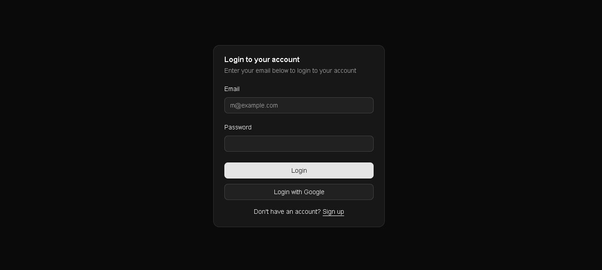
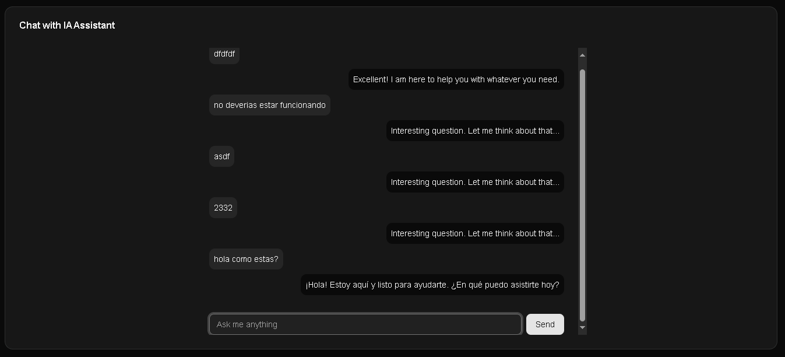
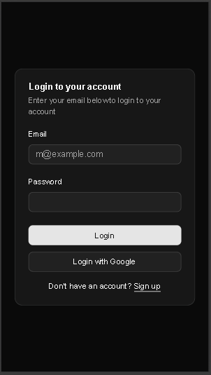
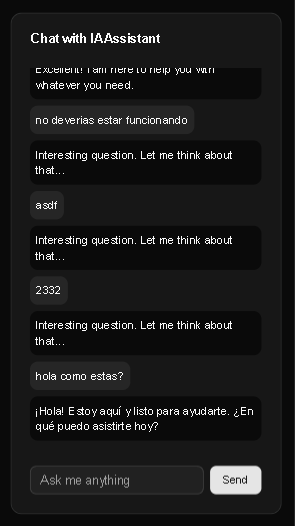

# Chat App - Documentación

## 📋 Descripción

Chat App es una aplicación de chat en tiempo real construida con Next.js 15, TypeScript, Firebase y Zustand. Permite a los usuarios autenticarse y enviar mensajes con un asistente de IA.

## 🖼️ Capturas de Pantalla

<div align="center">
  
  
  
  
</div>

## 🏗️ Arquitectura

### Stack Tecnológico
- **Frontend**: Next.js 15 + React 19 + TypeScript
- **Estado**: Zustand
- **Autenticación**: Firebase Auth
- **Formularios**: React Hook Form + Yup
- **UI**: Tailwind CSS + Radix UI
- **Notificaciones**: React Toastify
- **Iconos**: Lucide React

### Patrón de Arquitectura
```
┌─────────────────┐    ┌─────────────────┐    ┌─────────────────┐
│   Components    │    │      Hooks      │    │      Store      │
│   (UI Layer)    │◄──►│  (Logic Layer)  │◄──►│  (State Layer)  │
└─────────────────┘    └─────────────────┘    └─────────────────┘
         │                       │                       │
         ▼                       ▼                       ▼
┌─────────────────┐    ┌─────────────────┐    ┌─────────────────┐
│    Services     │    │     Domain      │    │   Configuration │
│  (API Layer)    │    │   (Models)      │    │   (Env/Config)  │
└─────────────────┘    └─────────────────┘    └─────────────────┘
```

## 📁 Estructura del Proyecto

```
src/
├── app/                          # App Router (Next.js 15)
│   ├── (protected)/              # Rutas protegidas
│   │   └── chat/                 # Página del chat
│   ├── auth/                     # Rutas de autenticación
│   │   ├── login/                # Página de login
│   │   └── register/             # Página de registro
│   ├── api/                      # API Routes
│   │   └── messages/             # Endpoint de mensajes
│   ├── actions/                  # Server Actions
│   ├── hooks/                    # Custom Hooks
│   ├── store/                    # Estado global (Zustand)
│   ├── validations/              # Esquemas de validación
│   └── util/                     # Utilidades del servidor
├── components/                   # Componentes React
│   ├── ui/                       # Componentes base (Radix UI)
│   └── [componentes específicos] # Componentes de la app
├── configuration/                # Configuración
│   └── environments.ts           # Variables de entorno
├── domain/                       # Modelos de dominio
├── lib/                          # Utilidades compartidas
└── services/                     # Servicios externos
    ├── api/                      # Servicios de API
    └── firebase/                 # Configuración Firebase
```

## 📝 Convenciones de Nomenclatura

### Archivos y Carpetas

#### Componentes React
```typescript
// ✅ Kebab-case para archivos
login-form.tsx
message-form.tsx
user-message.tsx

// ✅ PascalCase para componentes
export function LoginForm() { }
export default function MessageForm() { }


// ✅ CamelCase para funciones
export default function useLogin() { }
export const useSendMessage = () => { }


// ✅ CamelCase para hooks
export const useMessageStore = create<MessageStore>()
export const useUserStore = create<UserStore>()
```

### Variables y Funciones

#### Variables
```typescript
// ✅ camelCase para variables
const userName = "John";
const isAuthenticated = true;
const messageList = [];


## 🔧 Configuración

bash
# Desarrollo
npm run dev          # Inicia servidor de desarrollo con Turbopack

# Producción
npm run build        # Construye la aplicación
npm run start        # Inicia servidor de producción

# Linting
npm run lint         # Ejecuta ESLint
```

## 📦 Dependencias Principales

### Producción
- **Next.js 15**: Framework React con App Router
- **TypeScript**: Tipado estático
- **Zustand**: Gestión de estado
- **Firebase**: Autenticación y backend
- **React Hook Form**: Manejo de formularios
- **Yup**: Validación de esquemas
- **Tailwind CSS**: Framework CSS
- **Shadcn UI**: Componentes accesibles
- **React Toastify**: Notificaciones

### Desarrollo
- **ESLint**: Linting de código
- **Tailwind CSS**: PostCSS y configuración

## 📖 Recursos Adicionales

- [Next.js Documentation](https://nextjs.org/docs)
- [React Documentation](https://react.dev/)
- [TypeScript Handbook](https://www.typescriptlang.org/docs/)
- [Zustand Documentation](https://github.com/pmndrs/zustand)
- [Firebase Documentation](https://firebase.google.com/docs)
- [Tailwind CSS Documentation](https://tailwindcss.com/docs)
